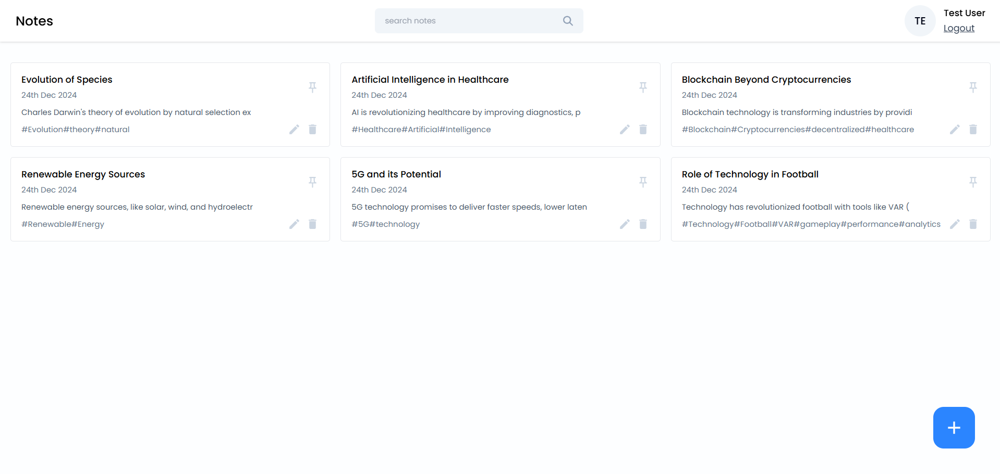
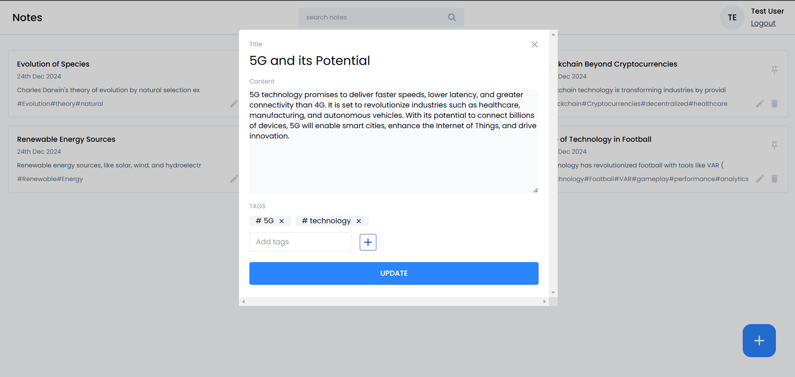

# Notes App

A full-stack notes application built with **React**, **Node.js**, **Express.js**, **MongoDB**, and **Tailwind CSS**. This app allows users to manage their notes efficiently with features like adding, editing, deleting, and pinning notes. A secure login/signup system ensures personalized access to user accounts.

---

## Features

- **CRUD Operations**: Add, edit, delete notes.
- **Pin Notes**: Highlight important notes by pinning them.
- **Authentication**: Secure login/signup system for personalized note management.
- **Responsive UI**: Built with React and styled using Tailwind CSS for an interactive and modern design.

---

## Tech Stack

- **Frontend**: React, Tailwind CSS
- **Backend**: Node.js, Express.js
- **Database**: MongoDB

---

## Installation and Setup

1. Clone the repository:
   ```bash
   git clone https://github.com/your-username/notes-app.git
   cd notes-app
   ```

2. Install dependencies:
   ```bash
   npm install
   cd client
   npm install
   ```

3. Set up the environment variables:
   - Create a `.env` file in the root directory.
   - Add the following variables:
     ```
     MONGO_URI=your-mongodb-connection-string
     JWT_SECRET=your-jwt-secret
     ```

4. Start the development server:
   ```bash
   # In the root directory
   npm run dev
   ```

5. Open your browser and navigate to:
   ```
   http://localhost:3000
   ```

---

## Usage

- Sign up or log in to your account.
- Create, edit, or delete notes as needed.
- Pin notes to keep them prioritized.

---

## Screenshots

### Homepage


### Note Editor


---

## Contributing

Contributions are welcome! Please follow these steps:

1. Fork the repository.
2. Create a new branch:
   ```bash
   git checkout -b feature-name
   ```
3. Make your changes and commit:
   ```bash
   git commit -m "Add your message here"
   ```
4. Push to the branch:
   ```bash
   git push origin feature-name
   ```
5. Open a pull request.

---

## License

This project is licensed under the [MIT License](LICENSE).

---

## Acknowledgments

- Special thanks to the open-source community for providing great tools and resources!

---

